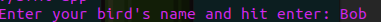
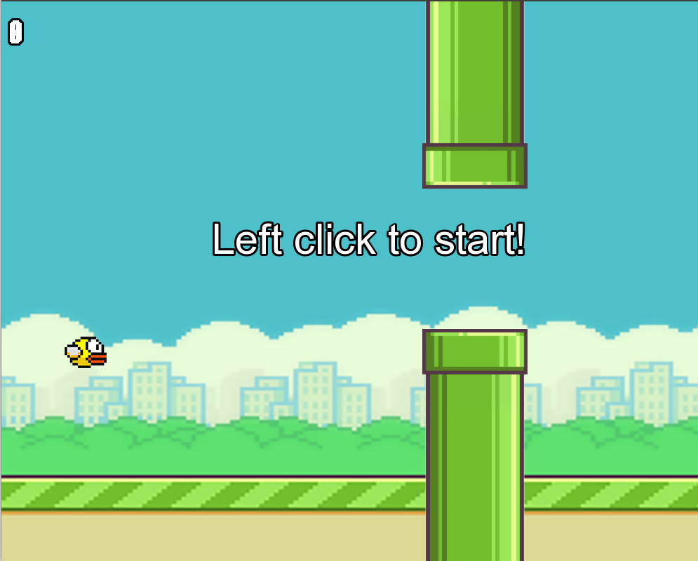
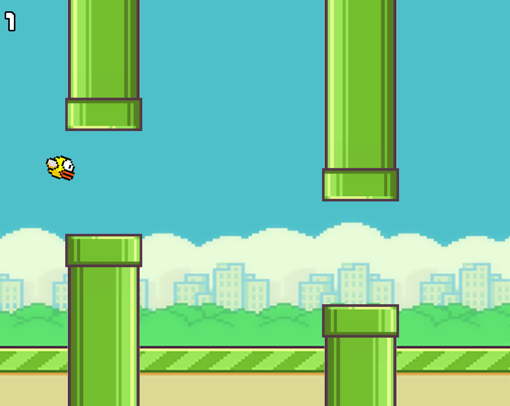
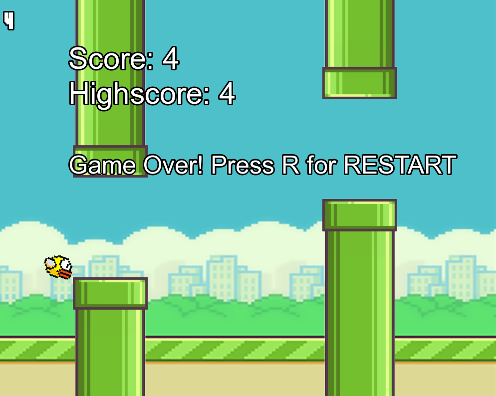
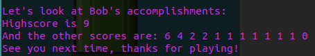

# Flappy Bird Game
###### Developed using C++ and SFML
### Game Presentation
- Give your flappy bird a name and start the game:    
    
- Start playing:    
    
    
- Restart when you lose:    
    
- Close game and see your achievements:    
    

### Features
- [x] Graphical Interface (SDL, SFML, Qt, etc.) - C++ API 
- [x] RTTI (Run-time type information)
- [x] Abstract Classes
- [x] Overloading Operators
- [x] Heap Memory Allocation
- [x] Exceptions
- [x] STL
- [x] Lambda expressions
- [x] Templates
- [x] Smart pointers
- [x] Design patterns
- [x] Features of C++17/20 (constexpr, consteval, constinit, fold expressions, init statement for if/switch, etc.)
